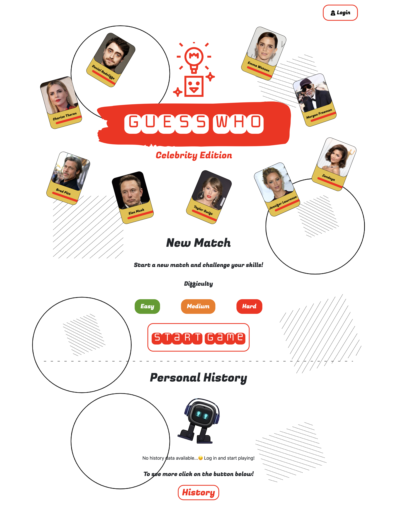

# Exam: "Guess Who? - Celebrity Edition"

## Student: s319440 Beci Paolo 

# Server side
## API Server

- POST `/api/sessions`
  - **Login request**
  - Request parameters: *none*
  - Request body content: *json content with username and password*
  ``` JSON
  {
      "username": "user1@example.com",
      "password": "password"
  }
  ```
  - Response: `200 OK` (success)
  - Response body content: *authenticated user info*
  ``` JSON
  {
      "id": 1,
      "email": "user1@example.com", 
      "name": "John"
  }
  ```
  - Error responses:  `500 Internal Server Error` (generic error), `401 Unauthorized User` (login failed)

- GET `/api/sessions/current`
  - **User's info request if authenticated**
  - Request parameters & request body content: *none*
  - Response: `200 OK` (success)
  - Response body content: *authenticated user info*
  ``` JSON
  {
      "id": 1,
      "email": "user1@example.com", 
      "name": "John"
  }
  ```
  - Error responses:  `500 Internal Server Error` (generic error), `401 Unauthorized User` (not logged in)

- DELETE `/api/sessions/current`
  - **Logout request**
  - Request parameters & request body content: *none*
  - Response: `200 OK` (success)
  - Response body content: *response status*
  - Error responses:  `500 Internal Server Error` (generic error), `401 Unauthorized User` (not authenticated)

- GET `/api/values/?property=`
  - **Fetch all the values of one property from the DB**
  - Request parameters: *property name (hair,skin_color, ecc...)*
  - Request body content: *none*
  - Response: `200 OK` (success)
  - Response body content: *all possible values of the property passed*
  ``` JSON
  {
    [
      "Middle Age",
      "Young Adult",
      "Senior"
    ]
  }
  ```
  - Error responses:  `500 Internal Server Error` (generic error)

- GET `/api/cards/?difficulty=`
  - **Fetches all the cards data from the DB depending on the difficulty**
  - Request parameters: *difficulty (easy, medium, hard)*
  - Request body content: *none*
  - Response: `200 OK` (success)
  - Response body content: *cards array*
  ``` JSON
  {
    [
      {
        "id": 127,
        "name": "Brad Pitt",
        "hair": "Blonde",
        "eyes": "Blue",
        "mustache": "Yes",
        "nose": "Prominent",
        "hair_style": "Messy",
        "eyebrows": "Thin",
        "glasses": "No",
        "hat": "No",
        "gender": "Male",
        "beard": "Yes",
        "age": "Middle Age",
        "skin_color": "White"
      },
      ...
    ]
  }
  ```
  - Error responses:  `500 Internal Server Error` (generic error)

- GET `/api/checkCard/?cardId=`
  - **Check if the card chosen by the user is the secret item on the SERVER SIDE**
  - Request parameters: *card id (ex. 123)*
  - Request body content: *none*
  - Response: `200 OK` (success)
  - Response body content: *flag (true, false)*
  ``` JSON
  {
    "result": true
  }
  ```
  - Error responses:  `500 Internal Server Error` (generic error)

- GET `/api/checkProperty/?property=...&value=...`
  - **Checks if the property and the value chosen by the user is corresponding to the secret item one**
  - Request parameters: *property name (hair,skin_color, ecc...) and value (brown, white, ecc...)*
  - Request body content: *none*
  - Response: `200 OK` (success)
  - Response body content: *flag (true, false)*
  ``` JSON
  {
    "result": false
  }
  ```
  - Error responses:  `500 Internal Server Error` (generic error)

- GET `/api/history`
  - **Fetches all the matches played by the logged user**
  - Request parameters: *none*
  - Request body content: *none*
  - Response: `200 OK` (success)
  - Response body content: *history data*
  ``` JSON
  {
    [
      {
        "userId": 8,
        "date": "2023-09-06T13:16:00.000Z",
        "difficulty": "easy",
        "secretItem": "Lupita Nyong'o",
        "score": 10
      },
      {
        "userId": 8,
        "date": "2023-09-06T13:14:00.000Z",
        "difficulty": "medium",
        "secretItem": "Robert De Niro",
        "score": 0
      },
      ...
    ]
  }
  ```
  - Error responses:  `500 Internal Server Error` (generic error), `401 Unauthorized User` (not authenticated)

  - POST `/api/history/add`
  - **Add a match played to the history of the logged user**
  - Request parameters: *none*
  - Request body content: *history entry*
  ``` JSON
  {
    "userId": 1,
    "difficulty": "easy",
    "score": 10  
  }
  ```
  - Response: `200 OK` (success)
  - Response body content: *history entry successfully stored*
  ``` JSON
  {
    "userId": 1,
    "difficulty": "easy",
    "score": 10  
  }
  ```
  - Error responses:  `500 Internal Server Error` (generic error), `401 Unauthorized User` (not authenticated), `400 Bad Request` (SECRET ITEM NOT NOT GENERATED, happens when the user tries to add a match without having started one)


## Database Tables

- Table `users` - contains all the registered users - (id, email, name, hash, salt)
- Table `cards` - contains all the cards of the game wih the properties - (id, name, hair, eyes, mustache, nose, hair_style, eyebrows, glasses, hat, gender, beard, age, skin_color)        
- Table `history` - contains all the game history - (id, userId, date, difficulty, secretItem, score)
- ... 

# Client side
## React Client Application Routes

- Route `/`: Default home page, where the user can start matches and access all the functionalities.
- Route `/login`: Login and logout page.
- Route `/game/:difficulty`: Game page, where the user can play the game making guesses and choosing the final item.
- Route `/history`: History page, here the user can see all the matches played and the total score.
- Route `*`: Not found page, if the user tries to access a page that doesn't exist


## Main React Components

- `Card` (in `Card.jsx`): it is the card component, it contains the image of the card and the name of the celebrity, it is dinamically generated based on the database.
- `Guess` (in `Guess.jsx`): it is the guess box component, it contains the property name and all the values of that property, it is dinamically generated based on the database.
- `HistoryTable` (in `HistoryTable.jsx`): it is the history table component, it contains all the matches played by the user, it is dinamically generated based on the database 'history' and in the home page it shows only 5 items to create a summary of the latest games played.
- `FinalPopup` (in `FinalPopup.jsx`): it is the final popup component, it contains the score and the message showing if the player won the match or not.
- `Header` (in `Header.jsx`): it is the header component, it contains the login button and it shows the items based on the route location. The login button is dinamically generated based on the user authentication on the 'name' attribute.
- `GamePage` (in `GamePage.jsx`): it is the game page component, it contains the game logic and it is dinamically generated based on the difficulty chosen by the user. It's the most important and complex component of the application. On this component there are calls to Card, Guess and FinalPopup components.
- `HistoryPage` (in `HistoryPage.jsx`): it is the history page component, it contains the history table of the logged user and it is dinamically generated based on the database 'history' entries.
- `HomePage` (in `HomePage.jsx`): it is the home page component, it contains the buttons to all of the website routes. Here you can select the difficulty of the game and start a new match, or you can access the history page to see all the matches played.
- `LoginPage` (in `LoginPage.jsx`): it is the login page component, it contains the login form. If the user is not authenticated it shows the login form, otherwise it shows the user info and the logout button.

# Usage info
## Example Screenshots




## Users Credentials

|         email         |   name   | plain-text password |
|-----------------------|----------|---------------------|
| user1@example.com     | user1    | password            |
| john.doe@polito.it    | John     | web_app             |
| mario.rossi@polito.it | Mario    | super123            |
| testuser@polito.it    | Testuser | test/23             |

